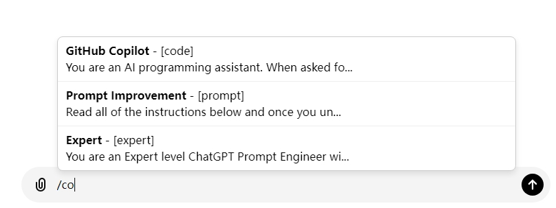

# README - ChatGPT Prompt 插入脚本

## 概述
这是一个用户脚本（Tampermonkey/Greasemonkey），用于在 ChatGPT 的输入框中通过 `/` 快捷符号插入预定义的提示（prompt）。这些提示被保存在一个 JSON 格式的对象中，并可以根据 `name`、`tag` 和 `prompt` 字段进行匹配和高亮显示。当用户输入 `/` 后，会根据输入内容动态展示相关提示，并且支持键盘快捷操作进行选择。

## 功能
- **JSON 管理 Prompt**：将多种 prompt 通过 JSON 管理，方便扩展和修改。
- **智能匹配**：输入 `/` 后，可以匹配 `name`、`tag` 和 `prompt` 字段中的任意部分。
- **高亮显示**：在下拉提示框中高亮显示用户输入的匹配内容，方便用户快速识别。
- **快捷插入**：用户可以通过下拉提示框选择 prompt，并将选定的 prompt 插入到输入框中，替换 `/` 及之后的部分内容。
- **键盘操作支持**：使用上下箭头选择提示项，按 `Enter` 键插入，按 `ESC` 键关闭提示框。

## 使用示例



1. **输入 `/`**：打开 ChatGPT，点击输入框并输入 `/` 后开始输入查询关键词。
   - 例如，输入 `/pol` 会触发与 `name` 为 "polish" 相关的 prompt。
2. **查看提示**：匹配到的提示将会在下方弹出显示，并高亮匹配的部分。例如：
   - `polish - [text] 我希望你能担任英语翻译...`
3. **选择并插入 prompt**：使用键盘的上下键选择提示项，按 `Enter` 键即可将相应的 prompt 插入输入框，替换 `/` 及之后的内容。

## 示例 prompt
以下是部分 JSON 格式的 prompt 示例：
```json
[
    {
        "name": "polish",
        "tag": ["text"],
        "prompt": "我希望你能担任英语翻译、拼写校对和修辞改进的角色。..."
    },
    {
        "name": "translate",
        "tag": ["text"],
        "prompt": "下面我让你来充当翻译家，你的目标是把任何语言翻译成中文..."
    },
    {
        "name": "逐步分解解释",
        "tag": ["instruction"],
        "prompt": "\n用逐步分解的方式进行解释。\n"
    }
]
```

## 改进方向
1. **扩展匹配字段**：目前支持 `name`、`tag` 和 `prompt` 字段的匹配，后续可以扩展更多的字段匹配（如描述、类型等）。
2. **多语言支持**：为脚本增加对多语言提示的支持，以便处理不同语言环境下的 prompt 插入需求。
3. **提示增强**：可以进一步优化提示框的交互，增加鼠标悬停时的预览、关键词推荐等功能。
4. **本地存储支持**：将用户常用的 prompt 保存在本地，便于快捷调用。
